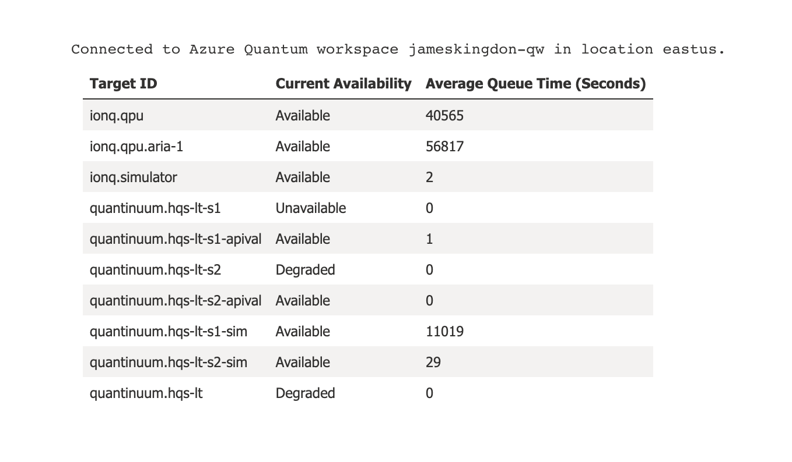

# azure-quantum-hackathon-summer-2022

# Overview

The goal is to compare performance across providers. Originally the idea was to compare superconducting qubit performance against trapped ion qubit performance, alas I have yet to receive Preview access to Rigetti's target hardware. Was also planning to compare the performance of IonQ's real trapped ion computer vs Quantinuum's , but the queue times stretch to over half a day. If I had more free time this would be part of my results. The main objective here is to see which provider is most reliable and fastest.

# Experiment

As an example job workload, I have chosen Grovers Search algorithm. I felt it sufficiently complex (gate operation wise) to demonstrate comparable differences in performance. I then target IonQ's simulator and Quantinuum's simulator and compare peformance. 

# Results

## Reliability

It seems that as far as potential targets, IonQ seems to win out on reliability. Quantinuum offers some syntax checker targets which is nice, but ultimately the target hardware is mostly degraded or unavailable.

