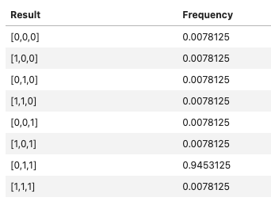
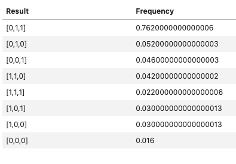

# azure-quantum-hackathon-summer-2022

# Overview

The goal is to compare target providers. Originally the idea was to compare superconducting qubit performance against trapped ion qubit performance, alas I have yet to receive Preview access to Rigetti's target hardware. Was also planning to compare the performance of IonQ's real trapped ion computer vs Quantinuum's , but the queue times stretch to over half a day. If I had more free time this would be part of my results. The main objective here is to see which provider is most reliable and fastest.

# Experiment

As an example job workload, I have chosen Grovers Search. I felt it sufficiently complex (gate operation wise) to demonstrate comparable differences in performance. I then target IonQ's simulator (ionq.simulator) and Quantinuum's simulator (quantinuum.hqs-lt-s2-sim) and compare peformance. 

# Results

## Reliability

### Targets

It seems that as far as potential targets, IonQ seems to be most reliable. Quantinuum offers some syntax checker targets which is nice, but ultimately the target hardware is frequently degraded or unavailable. The queue time for IonQ's simulator is 2 seconds, while for Quantinuum it is 11019 seconds.

### Output

It's also interesting that the output from IonQ vs Quantinuum is quite different. The method of simulation is likely different, possibly such that there were trade-offs made on speed vs accuracy

#### IonQ

#### Quantinuum

## Speed

IonQ's execution time was less than 1 second.

Quantinuum's execution time was 23 seconds.

# Conclusion

Unfortunate that I wasn't able to do a proper comparison between superconducting qubits vs trapped ion qubits, however it was still interesting to compare the providers simulator performance. On both performance and reliability it seems that IonQ is better. However, one nice feature of Quantinuum is the syntax checker targets, which IonQ does not provide. So we could say there's pros and cons of each provider.
